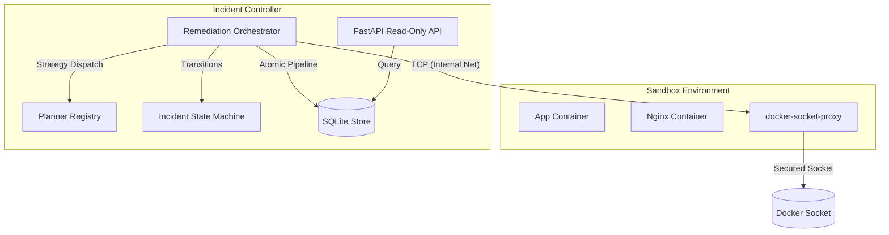
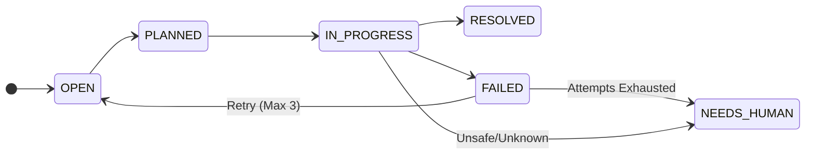

<div align="center">
  
  
  
</div>

<h1 align="center">Docker Incident Controller</h1>

<p align="center">
  <strong>A proof-of-concept Python agent that monitors local Docker containers and automatically executes hardcoded remediation rules.</strong>
</p>

<p align="center">
  
  
  
</p>

---

## What It Is

The Docker Incident Controller is an experimental script designed to demonstrate how a local Python worker can observe Docker containers through a proxy and attempt to fix predefined issues. It polls the container state, matches anomalies to a small set of known failure signatures (e.g., an Nginx configuration syntax error), and runs basic remediation plans such as replacing the config and restarting the container.



## System Implementation

| Component | Technical Description |
| :--- | :--- |
| **Transport Security** | Uses `docker-socket-proxy` over an internal TCP network instead of a raw `/var/run/docker.sock` mount to limit privileges. |
| **Orchestrator** | A dedicated `RemediationOrchestrator` coordinates the `Observe → Detect → Persist → Plan` pipeline cleanly. |
| **Pipeline Atomicity** | The pipeline runs inside a single `SQLiteStore.transaction()` context to avoid partial state writes and TOCTOU vulnerabilities. |
| **Deduplication** | Unique constraints and `INSERT OR IGNORE` ensure identical concurrent observations don't create duplicate incidents. |
| **Planner Registry** | A dynamic strategy pattern (`PlannerRegistry`) maps anomalies against discrete rule classes (e.g., `AppCrashLoopPlanner`) and decorators (`RetryAwarePlanner`). |
| **Failure Resiliency** | An `IncidentStateMachine` manages lifecycles, retrying failed remediations with exponential backoff up to 3 times via the orchestrator. |
| **Security Boundaries** | Uses `pathlib.Path.resolve` to prevent directory traversal during file-read/write tool operations. |

---

## Getting Started

**IMPORTANT:**
The deployment relies on Docker Compose and an isolated Python virtual environment. Python 3.11+ is required.

<details>
<summary><strong>Required Environment Variables</strong></summary>

```env
# Configures the agent to communicate with the proxy instead of a local socket
DOCKER_HOST=tcp://socket-proxy:2375
# The frequency of the observation loop
POLL_INTERVAL_SECONDS=5
# Output format for standard logging
LOG_FORMAT=json
# Maximum automated remediation attempts before escalating
MAX_RETRIES=3
```
</details>

### 1. Installation

```bash
# Create and activate an isolated virtual environment
python -m venv venv
source venv/bin/activate  # On Windows: venv\Scripts\activate

# Install the package and development dependencies
pip install -e ".[dev]"
```

### 2. Run the Sandbox Stack

Initialize the agent, the target applications (e.g., Nginx and the Python application), and the TCP socket proxy.

```bash
docker compose up --build
```

#### Exposed Endpoints

| Service | URL | Description |
| :--- | :--- | :--- |
| **Agent API** | `http://localhost:8000` | Root API access exposing agent metadata. |
| **Metrics** | `http://localhost:8000/metrics` | Prometheus metrics for health tracking. |
| **Incidents** | `http://localhost:8000/incidents` | Read-only access to query incident data. |
| **Observations** | `http://localhost:8000/observations?limit=100` | Raw container states and health-check outputs. |
| **App Health** | `http://localhost:8080/health` | The health endpoint of the target application. |

### 3. Fault Injection Demo

You can artificially trigger an anomaly within the sandbox to see the agent detect and fix it.

**TIP:** Run `docker compose logs -f agent` in a separate terminal to watch the state transitions and remediation plan execute.

**Unix:**
```bash
sh fault_injection/break_nginx_config.sh
sh fault_injection/enable_app_crash.sh
```

**Windows:**
```powershell
.\fault_injection\break_nginx_config.ps1
.\fault_injection\enable_app_crash.ps1
```

To manually reset the sandbox:
```bash
docker compose down --volumes
docker compose up --build
```

---

## State Machine Lifecycle

The `IncidentStateMachine` ensures valid transitions between states.



On startup, any incident left in the `IN_PROGRESS` state due to a shutdown is transitioned to `NEEDS_HUMAN` or `FAILED` to prevent unsafe resumption of tasks.

---

## Known Limitations

**WARNING:**
This system is an experimental proof-of-concept. The following constraints apply:

- **Restricted Mounts**: The agent requires direct write access to local `runtime` and `nginx_conf` volume mounts to execute fixes. This bypasses standard orchestrator configurations and introduces a file-system attack surface.
- **Single Node Concurrency**: Designed strictly for a single-instance deployment. Running concurrent workers will cause database lock contention and duplicate execution.
- **Predefined Rule Scope**: Only handles explicitly hardcoded failure signatures. It does not use LLMs or dynamic heuristics to explore unknown anomalies.
- **Docker Dependency**: Tightly coupled to the Docker API syntax. It does not support Kubernetes or containerd natively.
- **Transient Error Resilience**: While the loop skips temporarily faulty containers, prolonged unavailability of the `docker-socket-proxy` will halt observation entirely.
