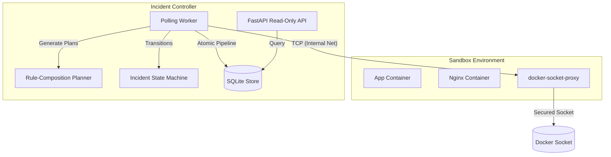
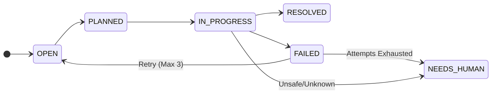

<div align="center">
  
  
  
</div>

<h1 align="center">Docker Incident Controller</h1>

<p align="center">
  <strong>Autonomous container observation, anomaly detection, and stateful remediation.</strong>
</p>

<p align="center">
  
  
  
</p>

---

## System Architecture Overview

The Docker Incident Controller is an autonomous agent designed to run alongside a target workload. It continuously polls container state through a secured TCP proxy, evaluates container metrics against known failure signatures, and executes targeted, Python-based remediation procedures (such as configuration rollbacks or restarting failed components).



## Core System Features

| System Component | Implementation | Technical Description |
| :--- | :--- | :--- |
| **Transport Security** | `docker-socket-proxy` | The agent communicates exclusively via a secured internal TCP proxy. Raw Docker socket (`/var/run/docker.sock`) mounts are strictly avoided, limiting the agent's privileges to a subset of the Docker API. |
| **Pipeline Atomicity** | SQLite Transactions | The core polling loop executes an `observe -> detect -> persist` sequence. This sequence is wrapped within a single database transaction to guarantee that system state anomalies and resulting incident records are consistently committed or rolled back together. |
| **Deduplication** | Unique Constraints | Incident deduplication is enforced at the data layer. A partial unique index combined with `INSERT OR IGNORE` ensures identical concurrent observations map to a single unified incident. |
| **Remediation Planner** | Rule-Composition | Instead of hardcoded procedures, a dynamic rule evaluation system maps detected anomalies against a registry of failure signatures to construct explicit, validated step-by-step remediation plans. |
| **Failure Resiliency** | `IncidentStateMachine` | Explicit state transitions govern incident lifecycles. Remediation failures automatically transition the incident from `FAILED` back to `OPEN`, allowing up to 3 automated retry attempts before escalating to human intervention. |
| **Security Boundaries** | `pathlib.Path.resolve` | All file-read and file-write operations (such as editing proxy configurations) utilize strict path confinement logic to mitigate directory traversal vulnerabilities. |
| **Observability** | JSON logs & `/metrics` | The system emits structured JSON logs for programmatic aggregation and exposes a Prometheus-compatible `/metrics` endpoint to track incident counts, remediation actions, and retry rates. |
| **Data Serialization** | Strict Pydantic | Pydantic data models disable enum value coercion (`use_enum_values=False`) to enforce strict type checking and defend against implicit deserialization errors. |

---

## Getting Started

**IMPORTANT:**
The deployment relies on Docker Compose and an isolated Python virtual environment. Python 3.11+ is required.

<details>
<summary><strong>Required Environment Variables</strong></summary>

```env
# Configures the agent to communicate with the proxy instead of a local socket
DOCKER_HOST=tcp://socket-proxy:2375
# The frequency of the observation loop
POLL_INTERVAL_SECONDS=5
# Output format for standard logging
LOG_FORMAT=json
# Maximum automated remediation attempts before escalating
MAX_RETRIES=3
```
</details>

### 1. Installation

```bash
# Create and activate an isolated virtual environment
python -m venv venv
source venv/bin/activate  # On Windows: venv\Scripts\activate

# Install the package and development dependencies
pip install -e ".[dev]"
```

### 2. Run the Sandbox Stack

Initialize the agent, the target applications (e.g., Nginx and the Python application), and the TCP socket proxy.

```bash
docker compose up --build
```

#### Exposed Endpoints

| Service | URL | Description |
| :--- | :--- | :--- |
| **Agent API** | `http://localhost:8000` | Root API access exposing agent metadata. |
| **Metrics** | `http://localhost:8000/metrics` | Prometheus metrics for health tracking and SLA monitoring. |
| **Incidents** | `http://localhost:8000/incidents` | Read-only access to query current and historical incident data. |
| **Observations** | `http://localhost:8000/observations?limit=100` | Raw container states and health-check outputs recorded during polling. |
| **App Health** | `http://localhost:8080/health` | The health endpoint of the target application being monitored. |

### 3. Fault Injection Demo

You can artificially trigger an anomaly within the sandbox to observe the agent's detection and automated remediation capabilities.

**TIP:**
Run `docker compose logs -f agent` in a separate terminal to watch the state machine transitions and remediation plan execution in real-time.

**Unix:**
```bash
sh fault_injection/break_nginx_config.sh
sh fault_injection/enable_app_crash.sh
```

**Windows:**
```powershell
.\fault_injection\break_nginx_config.ps1
.\fault_injection\enable_app_crash.ps1
```

To manually reset the sandbox to a clean state:
```bash
docker compose down --volumes
docker compose up --build
```

---

## State Machine Lifecycle

The `IncidentStateMachine` enforces valid transitions to prevent the execution of indeterminate or conflicting remediation plans. 



**NOTE:**
On startup, the system performs a consistency check. Any incident left in the `IN_PROGRESS` state due to an abrupt shutdown is automatically transitioned to `NEEDS_HUMAN` or `FAILED`. This conservative policy prevents the unsafe resumption of partially executed remediation tasks.

---

## Performance Metrics

| Metric | Target / Measurement |
| :--- | :--- |
| **p95 Observation Latency** | `< 500ms` (Local execution) |
| **Incident Recall** | `100%` (For modeled failure signatures) |
| **Throughput** | `~600 observations/minute` (Dependent on compose footprint) |

---

## Known Limitations & Technical Debt

**WARNING:**
This system is designed as an experimental sandbox to demonstrate agentic capabilities. The following constraints and security considerations apply to the current architecture:

- **Restricted Mounts**: The agent currently requires direct write access to the local `runtime` and `nginx_conf` volume mounts to execute its remediation plans. In a true production environment, this approach bypasses standard orchestrator-managed configurations (e.g., Kubernetes ConfigMaps) and introduces a potential file-system attack surface.
- **Single Node Concurrency**: The SQLite persistence layer and the polling mechanism are strictly designed for a single-instance deployment. Running concurrent controller workers will result in database lock contention and duplicate incident execution due to the lack of distributed locking.
- **Predefined Rule Scope**: The Rule-Composition Planner only handles explicitly defined failure signatures (such as Nginx configuration syntax errors or specific application crash flags). Unrecognized anomalies are ignored and will not trigger generalized LLM-based exploration.
- **Docker Dependency**: The agent is tightly coupled to the Docker API syntax and object models. It does not natively support Kubernetes orchestration or containerd runtimes.
- **Transient Error Resilience**: While the main observation loop catches standard `DockerAPIError` exceptions to skip temporarily faulty containers without crashing, a prolonged unavailability of the `docker-socket-proxy` will halt the entire observation pipeline until connectivity is restored.
